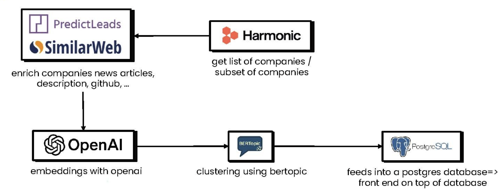

#  Pulse


> This project was built as part of the Data-Driven VC Hackathon organized by [Red River West](https://redriverwest.com) & [Bivwak! by BNP Paribas](https://bivwak.bnpparibas/)

## General idea

This project aims to tackle the lack of granularity and static nature of current market segmentations done by most data providers or VCs.

We propose a dynamic data-driven approach to segment companies and identify markets without the need for manual intervention. This approach is based on the analysis of enriched textual data from companies retrieved from different sources including (Website, Github, PredictLads, ...) and the use of NLP techniques (embedding clustering) to classify them into different topics.

We then give a brief overview of those markets by aggregating the data from multiple companies and reprensenting the market trends as a whole.

Here is a brief overview of the workflow


## Prerequisites (assuming Mac environment, with Homebrew installed)

### LLVM

```bash
brew install llvm
```

### Python/Rye

You can use rye to automatically manage your Python environment otherwise you require Python 3.12.x

```bash
brew install rye
```

```bash
rye sync
```

### Node.js/Bump

Need Node.js v20.11.1^

```bash
brew install bun
```

### Database

We're using Postgres v15.8^

We're using [Supabase](https://supabase.com) as our database, you'll need to create a project and get the database URL.

## Table Schema

See [docs/schema.md](docs/schema.md)

## Code Structure

- [src/collect](src/collect): Data collection scripts
- [src/nlp_pipeline](src/nlp_pipeline): NLP pipeline scripts
- [src/utils](src/utils): Utility scripts (e.g. database connection)
- [front](front): Frontend code

## Data collection

Add a `.env` file in the root of the project based on `.env.example`
and a `front/.env` in the `front` directory based on `front/.env.example`

Run the following commands to collect data:

```bash
rye run harmonic
rye run predictleads
rye run predictleads_news
rye run pdl_headcount_sales_eng
rye run similarweb
```

## NLP pipeline

See [docs/nlp_pipeline.md](docs/nlp_pipeline.md)

```bash
rye run nlp_pipeline
```

## Frontend

```bash
cd front
bun install
bun dev
```

## Next Steps for a Comprehensive Product

### Features

- Expand the dataset by including more companies and enhancing clustering with additional media sources (e.g., news articles, website content, etc.).
- Introduce user-created taxonomies for a personalized and tailored experience.
- Enrich cluster information with more data to deterministically identify whether a segment is trending.

### Technical Enhancements

- Implement embedding pipelines in **Airflow** for optimized orchestration and scalability.
- Deploy the application online for broader accessibility.
- Improve database latency by hosting the database for faster and more reliable performance.
